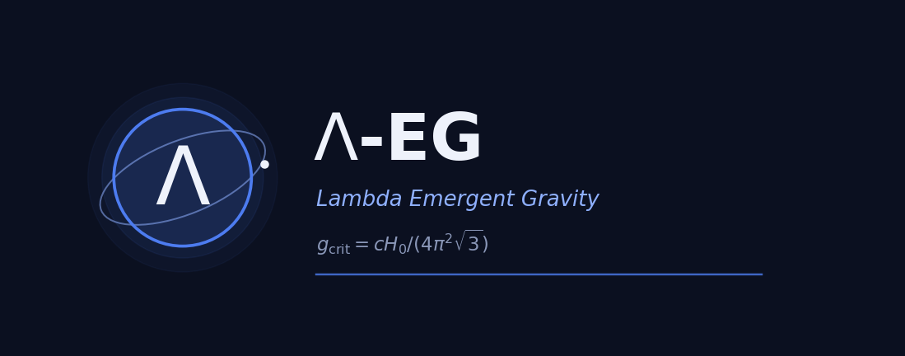

# Λ-EG — Emergent Gravitational Coherence · **T.O.C.**
### Theory · Ontology · Cosmology

**Canonical consolidated record** of the Λ-EG (*Lambda Emergent Gravity*) programme by
J. Pablo Figueroa Torres. This repository consolidates the earlier scattered records
(listed below) into a single citable lineage — the one to cite from here on.

## Contents (this version)

- **Framework (v9)** — `Lambda-EG_framework_v9.pdf` — covariant scalar–tensor
  emergent-gravity framework. `g_crit` derived from De Sitter spectral geometry;
  the BTFR zero-point uses **a₀ = 4π·g_crit**. The **v8** revision incorporates the
  reviewer-response corrections: screened scalar–tensor / deep-MOND framing (not an
  exact AQUAL reduction), scalar spectral-gap origin of `√3`, complete kinetic
  function `μ(x)=x/√(1+x²)`, corrected Cassini (`α≳8×10⁶`) and Bullet (`√(π/2)`)
  estimates, and stress-energy lensing. The **v9** revision adds one declared
  assumption: the redshift scaling `g_crit(z) ∝ H(z)` is the *instantaneous-de Sitter*
  reading of the spectral derivation (the identity `R = 12H²` is exact only in de Sitter),
  and the covariant alternative `g_crit ∝ √R` is stated with its numerical consequences.
- **JADES DR4** — `Lambda-EG_JADES_DR4.pdf` — confrontation with high-redshift JWST data.
  *This revision corrects the quoted zero-point evolution, whose redshift labels were
  shifted by one row (the values 0.17/0.20/0.26 dex correspond to z = 3/4/6), and declares
  the same de Sitter assumption. Conclusions are unchanged: the test is calibration-limited.*
- **µ-theorem (letter)** — `Lambda-EG_mu_theorem_letter.pdf` — geometric characterization
  of the standard MOND interpolating function `μ(x)=x/√(1+x²)` as the isotropic
  distribution of `cot θ` (26/26 symbolic + Monte-Carlo checks pass). **v3** adds a general
  exclusion criterion: expanding any interpolating function as `μ = x + c₂x² + …`, the
  Tully–Fisher flow is analytic at its fixed point **iff `c₂ = 0`**. The simple, TeVeS-toy
  and exponential functions fail it — their flow is not Lipschitz there, so the departure
  reaches zero in *finite* flow time and the relation is predicted to become **bimodal**
  rather than merely narrower. Reproducible from `audit_theorem.py`, `flow_coeffs.py`,
  `final_table.py` and `make_figure.py`.

## Forthcoming (future versions of this record)

- **Cosmology** — CMB / FLRW extension. *In preparation — not released yet.*
- **Ontology** — emergent-spacetime chain `Gμν = Ψ(Φ(E(R(Ω))))`. *In preparation.*

## Author

**J. Pablo Figueroa Torres** — ORCID [0009-0005-5297-8777](https://orcid.org/0009-0005-5297-8777)

## Lineage

**Framework** — the same document across **9 versions** (Zenodo record, uploaded
manually), grouped under a single **concept DOI** — cite this one for all versions
(it always resolves to the latest):

> **[10.5281/zenodo.19784004](https://doi.org/10.5281/zenodo.19784004)** — concept DOI (all framework versions)

| Version | DOI | Date |
|---|---|---|
| v9 | (this revision) | 2026-07-21 |
| v8 | [10.5281/zenodo.21430421](https://doi.org/10.5281/zenodo.21430421) | 2026-07-18 |
| v7 | [10.5281/zenodo.21307522](https://doi.org/10.5281/zenodo.21307522) | 2026-07-11 |
| v6 | [10.5281/zenodo.20369196](https://doi.org/10.5281/zenodo.20369196) | 2026-05-24 |
| v5 | [10.5281/zenodo.20190073](https://doi.org/10.5281/zenodo.20190073) | 2026-05-14 |
| v4 | [10.5281/zenodo.20066729](https://doi.org/10.5281/zenodo.20066729) | 2026-05-07 |
| v3 | [10.5281/zenodo.20046966](https://doi.org/10.5281/zenodo.20046966) | 2026-05-05 |
| v2 | [10.5281/zenodo.19974554](https://doi.org/10.5281/zenodo.19974554) | 2026-04-02 |
| v1 | (initial version) | — |

**Related records by the same author** (separate documents):

| Record | DOI |
|---|---|
| Emergent gravity / De Sitter | [10.5281/zenodo.19674722](https://doi.org/10.5281/zenodo.19674722) |
| Coherence model | [10.5281/zenodo.19364572](https://doi.org/10.5281/zenodo.19364572) |
| Spacetime ontology | [10.5281/zenodo.19013213](https://doi.org/10.5281/zenodo.19013213) |

## License

Creative Commons Attribution 4.0 International (CC-BY-4.0).
